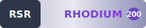

= Fogbinder

image:https://img.shields.io/badge/License-MPL_2.0-blue.svg[MPL-2.0-or-later,link="https://opensource.org/licenses/MPL-2.0"]
image:https://img.shields.io/badge/Philosophy-Palimpsest-indigo.svg[Palimpsest,link="https://github.com/hyperpolymath/palimpsest-license"]

== License & Philosophy

This project must declare **MPL-2.0-or-later** for platform/tooling compatibility.

Philosophy: **Palimpsest**. The Palimpsest-MPL (PMPL) text is provided in `license/PMPL-1.0.txt`, and the canonical source is the palimpsest-license repository.

:toc: left
:toclevels: 3
:icons: font
:source-highlighter: rouge
:experimental:

link:https://github.com/hyperpolymath/rhodium-standard-repositories[]

**Fogbinder** is a Zotero plugin designed for those who seek nuance in their research. It illuminates contradiction, emotional tone, and unresolved ambiguity within citations—making murk not something to fear, but something to follow.

'''

== Features

=== Contradiction Detection

Identify when ideas across sources clash, inviting richer analysis and thematic depth.

=== Mood Scoring

Annotate and filter sources based on emotional tone—melancholy, ecstatic, anxious, etc.

=== Mystery Clustering

Surface and tag speculative or ambiguous references that spark curiosity.

=== FogTrail Visualization

A network map of epistemic opacity showing how your research clouds, contradicts, and clears.

'''

== Accessibility

Fogbinder follows inclusive design principles:

* Semantic HTML with proper `aria-label` and role attributes
* Keyboard navigation and focus indicators
* High-contrast UI elements
* Localization support for multilingual use

[quote]
_Ambiguity should never mean inaccessibility._

'''

== Security

Your privacy matters. Fogbinder:

* Sanitizes input to prevent injection
* Never stores API keys or external data
* Includes strict `.gitignore` and no tracking scripts
* Follows open-source transparency principles
* Uses post-quantum cryptography (Ed448, Kyber-1024, SHAKE256)
* Git operations via SSH only
* TLS 1.3 with strong ciphers

For detailed security information, see link:SECURITY.md[SECURITY.md].

'''

== Architecture

Fogbinder uses a **ReScript + WASM** architecture:

* **ReScript** - 100% type-safe functional programming language
* **WASM modules** - Performance-critical operations in Rust
* **Deno runtime** - JavaScript/WASM execution (no Node.js)
* **NO TypeScript** - Eliminated completely
* **NO npm** - No Node.js dependencies

See link:ARCHITECTURE_RESCRIPT_WASM.adoc[ARCHITECTURE_RESCRIPT_WASM.adoc] for details.

'''

== Installation

=== Prerequisites

* link:https://deno.land/[Deno] (1.40+)
* link:https://rescript-lang.org/[ReScript] compiler
* link:https://www.rust-lang.org/[Rust] + Cargo (for WASM modules)
* link:https://just.systems/[just] (command runner)
* link:https://www.zotero.org/[Zotero] (7.0+)

=== Build from source

[source,bash]
----
# Clone repository
git clone git@github.com:your-username/fogbinder.git
cd fogbinder

# Build ReScript
just build-rescript

# Build WASM modules
just build-wasm

# Build Zotero plugin
just build-plugin

# Install to Zotero
just install-zotero
----

=== Development

[source,bash]
----
# Run tests
just test

# Run benchmarks
just bench

# Watch mode
just dev

# Quality checks
just quality

# Security audit
just security-audit
----

See link:DEVELOPMENT.adoc[DEVELOPMENT.adoc] for detailed development instructions.

'''

== Usage

=== Basic workflow

1. **Install Fogbinder** in Zotero
2. **Select sources** in your library
3. **Run analysis** via Fogbinder menu
4. **Explore results**:
   - Contradictions highlighted
   - Mood scores displayed
   - Mystery clusters shown
   - FogTrail visualization

=== Advanced features

* **Custom mood categories** - Define your own emotional taxonomy
* **Contradiction severity** - Adjust detection sensitivity
* **Export FogTrail** - SVG, JSON, or interactive HTML
* **Batch processing** - Analyze entire collections

'''

== Philosophy

Fogbinder embraces **epistemic humility** and **ordinary language philosophy**:

* **Ambiguity is a feature** - Not a bug to be fixed
* **Contradictions invite analysis** - Not errors to be eliminated
* **Emotional tone matters** - Research is human
* **Accessibility is fundamental** - Software for all
* **Privacy is a right** - No surveillance, no tracking

See link:PHILOSOPHY.adoc[PHILOSOPHY.adoc] for philosophical foundations.

'''

== License

Fogbinder is **dual-licensed** - you choose:

=== Option 1: Palimpsest-MPL-1.0 License

Permissive license for maximum freedom.

=== Option 2: GNU PMPL-1.0

Network copyleft ensuring software freedom.

=== Palimpsest License (Philosophical Overlay)

Both licenses include the **Palimpsest License** as a philosophical commitment to:

* Epistemic humility
* Ordinary language principles
* Code as palimpsest (layers of meaning)
* Embracing contradiction
* Open inquiry
* Accessibility for all
* Privacy and autonomy
* Community over profit

See link:LICENSE_DUAL.adoc[LICENSE_DUAL.adoc] for full terms and decision guidance.

'''

== Contributing

We welcome contributions! Please read:

* link:CONTRIBUTING.adoc[CONTRIBUTING.adoc] - Contribution guidelines
* link:CODE_OF_CONDUCT.adoc[CODE_OF_CONDUCT.adoc] - Community standards
* link:DEVELOPMENT.adoc[DEVELOPMENT.adoc] - Development workflow
* link:ARCHITECTURE_RESCRIPT_WASM.adoc[ARCHITECTURE_RESCRIPT_WASM.adoc] - Technical architecture

'''

== Documentation

=== Core Documentation

* link:README.adoc[README.adoc] (this file)
* link:SECURITY.md[SECURITY.md] - Security policy
* link:CLAUDE.adoc[CLAUDE.adoc] - AI assistant guide
* link:PHILOSOPHY.adoc[PHILOSOPHY.adoc] - Philosophical foundations
* link:TPCF.adoc[TPCF.adoc] - The Philosophy of Computational Fog

=== Technical Documentation

* link:ARCHITECTURE_RESCRIPT_WASM.adoc[ARCHITECTURE_RESCRIPT_WASM.adoc] - Architecture overview
* link:API.adoc[API.adoc] - API reference
* link:DEVELOPMENT.adoc[DEVELOPMENT.adoc] - Development guide
* link:benchmarks/README.adoc[benchmarks/README.adoc] - Performance benchmarks
* link:formal-verification/README.adoc[formal-verification/README.adoc] - Formal verification

=== Security Documentation

* link:security/README.adoc[security/README.adoc] - Security overview
* link:security/CRYPTOGRAPHY.adoc[security/CRYPTOGRAPHY.adoc] - Cryptographic specifications
* link:security/GIT_SSH_CONFIG.adoc[security/GIT_SSH_CONFIG.adoc] - Git SSH configuration
* link:security/TLS_SSL_CONFIG.adoc[security/TLS_SSL_CONFIG.adoc] - TLS/SSL configuration
* link:security/BROWSER_FUTUREPROOFING.adoc[security/BROWSER_FUTUREPROOFING.adoc] - Browser feature future-proofing
* link:security/AUDIT_CHECKLIST.adoc[security/AUDIT_CHECKLIST.adoc] - Security audit checklist

=== Cookbooks

* link:docs/cookbooks/BEGINNER_COOKBOOK.adoc[Beginner Cookbook]
* link:docs/cookbooks/INTERMEDIATE_COOKBOOK.adoc[Intermediate Cookbook]
* link:docs/cookbooks/ADVANCED_COOKBOOK.adoc[Advanced Cookbook]
* link:docs/cookbooks/COMPLETE_COOKBOOK.adoc[Complete Cookbook]

'''

== Community

=== Support

* **Issues**: link:https://github.com/your-username/fogbinder/issues[GitHub Issues]
* **Discussions**: link:https://github.com/your-username/fogbinder/discussions[GitHub Discussions]
* **Security**: See link:SECURITY.md[SECURITY.md] for responsible disclosure

=== Maintainers

See link:MAINTAINERS.adoc[MAINTAINERS.adoc] for current maintainers.

'''

== Acknowledgments

Fogbinder is inspired by:

* **Wittgenstein's** ordinary language philosophy
* **Research practices** that value ambiguity
* **Open-source communities** prioritizing accessibility and privacy
* **Post-quantum cryptography** research (NIST PQC)
* **Functional programming** communities (OCaml, ReScript, Rust)

'''

== Repository Standards

Fogbinder achieves **RSR Rhodium** (highest tier) compliance:

* **Type Safety**: 100% ReScript, no TypeScript
* **Memory Safety**: No manual memory management
* **Build System**: No Node.js, no npm
* **Documentation**: AsciiDoc format
* **Security**: Post-quantum cryptography, Git SSH-only, TLS 1.3
* **Testing**: Property-based testing, benchmarks, formal verification
* **Accessibility**: WCAG 2.1 Level AA
* **Licensing**: Dual MIT/AGPL with Palimpsest overlay
* **WASM-First**: Maximum WASM, minimal JavaScript
* **Browser Future-Proofing**: 25+ browser APIs supported

See link:RSR_RHODIUM_STANDARD_V2.adoc[RSR_RHODIUM_STANDARD_V2.adoc] for full specification.

'''

**Last Updated:** 2025-11-29 +
**Version:** 0.1.0 +
**License:** MIT OR PMPL-1.0 (with Palimpsest) +
**RSR Tier:** Rhodium
